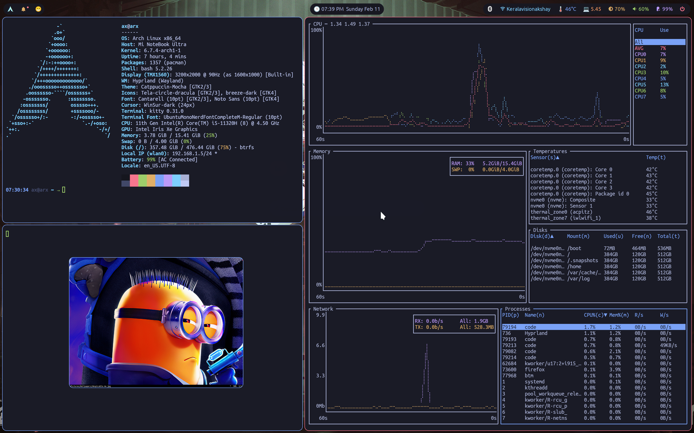

# **dotfiles**

A git repository to manage all my dotfiles.

### SCREENSHOT

## INCLUDED
1. [Hyprland](https://hyprland.org/)
2. [Waybar](https://github.com/Alexays/Waybar)
3. [rofi](https://davatorium.github.io/rofi/)
4. [swaync](https://github.com/ErikReider/SwayNotificationCenter)

### LINKS

`(https://wiki.archlinux.org/title/Dotfiles)`
`(https://news.ycombinator.com/item?id=11071754)`
